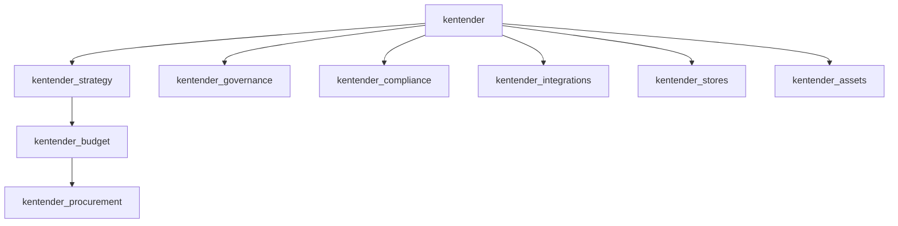

# KenTender app dependencies and boundaries

**Story:** STORY-CORE-002 (EPIC-CORE-001).  
**Canonical core name in tickets:** `kentender_core` — on this bench the Frappe app is **`kentender`**.

This document is the single source of truth for **allowed dependency direction**, **import/service rules**, and **shared naming**. Per-app READMEs point here.

## Dependency overview (DAG)

Allowed **KenTender → KenTender** dependency flows downward in this graph. Higher layers must not depend on lower layers (no reverse edges).

**Narrative**

- **`kentender`** — Foundation: master data, security primitives, shared utilities. No other KenTender app may be imported as a dependency of `kentender`.
- **`kentender_strategy`** — Depends on `kentender` only (among KenTender apps).
- **`kentender_budget`** — Depends on `kentender` and `kentender_strategy`.
- **`kentender_procurement`** — Depends on `kentender`, `kentender_strategy`, and `kentender_budget`.
- **`kentender_governance`**, **`kentender_compliance`**, **`kentender_integrations`** — Depend on `kentender`. They may **integrate** with strategy, budget, or procurement only through **stable, explicit entry points** (whitelisted `api` handlers, documented `frappe.call` contracts, or future shared interface modules in `kentender`). They must **not** import other apps’ internal `services/` or DocType controller modules.
- **`kentender_stores`**, **`kentender_assets`** — Downstream extensions on `kentender`. Core / strategy / budget / procurement must not depend on them except via the same explicit integration pattern if a future design requires it.

**ERPNext / ecosystem:** Reuse (Users, Company, Item, etc.) is governed by the PRD and the KenTender Cursor rules at `frappe-bench/.cursor/rules/kentender.mdc`; this doc only constrains **KenTender app-to-app** coupling.

## Allowed vs forbidden (matrix)

| App | Allowed upstream KenTender deps | Forbidden (examples) |
| --- | ------------------------------- | -------------------- |
| `kentender` | *(none)* | Importing any `kentender_*` package or coupling to downstream business apps |
| `kentender_strategy` | `kentender` | `kentender_budget`, `kentender_procurement`, governance/compliance/stores/assets/integrations internals |
| `kentender_budget` | `kentender`, `kentender_strategy` | `kentender_procurement` and anything downstream of it |
| `kentender_procurement` | `kentender`, `kentender_strategy`, `kentender_budget` | `kentender_stores`, `kentender_assets` as hard imports (use APIs if needed) |
| `kentender_governance` | `kentender` | Direct imports of `services/` or private modules in strategy/budget/procurement |
| `kentender_compliance` | `kentender` | Same as governance |
| `kentender_integrations` | `kentender` | Same as governance |
| `kentender_stores` | `kentender` | Upstream apps importing stores internals |
| `kentender_assets` | `kentender` | Same as stores |

## Frappe `required_apps`

Install order is enforced in each app’s `hooks.py` via `required_apps` (KenTender apps only; `frappe` is implicit). See the matrix in repository hooks; keep it aligned with this document when the DAG changes.

## Service-layer and cross-app interaction

Per-app **folder roles** (DocType vs `services/` vs `api/` vs `utils/` vs `tests/`) are specified in [**Application package layout**](application-package-layout.md) (STORY-CORE-003).

1. **Business logic** lives in `<app>/<app>/services/` (Python modules). DocType controllers stay thin (validation, hooks, orchestration calling services).
2. **Cross-app calls** must use explicit entry points: whitelisted methods under `api/`, documented `frappe.get_attr` / `frappe.call` to stable functions, or shared contracts placed in **`kentender`** when a small shared API is intentional.
3. **Do not** reach into another app’s `services/*.py` from unrelated apps without a documented, versioned contract (prefer moving shared surface to `kentender`).

## Circular import policy

- No KenTender app may list or import another app that (transitively) depends on it.
- Prefer **acyclic** imports following the DAG. If a cycle appears during development, refactor via `kentender` or a thin shared facade.

## Naming conventions

### DocTypes

- Follow Frappe: **PascalCase**, no spaces in DocType names.
- Prefer a **module- or app-unique prefix** when names could collide across apps (e.g. domain-specific prefix agreed in the module’s design doc).

### Service modules

- **snake_case** file names under `<app>/<app>/services/`.
- One primary responsibility per module; split when files grow or concerns diverge.

### Tests

- Files named **`test_*.py`** under `<app>/<app>/tests/`.
- Name tests after the behaviour or module under test.

### `business_id` and human-readable references

- Use **stable, human-readable** business identifiers where the PRD or ticket specifies a format.
- The internal PRD may evolve; until it defines a global pattern, use: **domain prefix + semantic code** (e.g. procurement vs budget namespaces must not collide), document per DocType in the story that introduces it, and keep generation/validation in **server-side** code (not client-only).

## How to use this document

- Before adding an import across apps or a new `required_apps` entry, check the **matrix** and **DAG**.
- When in doubt, add a short note in your PR and extend this file if the architecture intentionally changes.

## Related

- [Architecture index](README.md)
- [Wave 0 Ticket Pack — STORY-CORE-002](../dev/Wave%200%20Ticket%20Pack.md)
- Monorepo layout: [root README](../../README.md)
