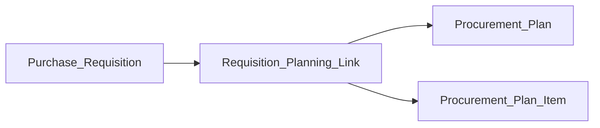

# KenTender Planning — Phased Roadmap

This document ties **what ships now** to **future template and governance work**, without changing the product shape you have already chosen.

## Architecture (locked)

1. **Procurement Plan Item** is a **standalone DocType** — it is **never** implemented as a child table on Procurement Plan.
2. **Requisition Planning Link** is the **canonical join** between a **Purchase Requisition** and optional **Procurement Plan** / **Procurement Plan Item**. Multiple links per requisition support partial and multi-plan allocation; naming differs from some specs that describe a child table on the plan item, but the **relationship pattern** is the same.

## Phase A — Delivered in procurement app (current wave)

- **Header cap:** Sum of **Active** `linked_amount` on Requisition Planning Link cannot exceed the requisition `requested_amount` (same float tolerance as planning derivation).
- **Optional line mode:** `purchase_requisition_item` + `linked_quantity` on the link; **Linked Amount** is derived as `linked_quantity × estimated_unit_cost` for a single source of truth; sum of Active `linked_quantity` per line cannot exceed the line `quantity`.
- **Rollups:** Purchase Requisition Item `planned_quantity` and `remaining_quantity` are maintained from Active links (and refreshed on requisition save).
- **Resolver inputs (data only):** Procurement Plan Item fields `complexity_classification`, `risk_level`, and `sector` — optional, **no** template resolution or approval gates yet.

Implementation references: `kentender_procurement.services.requisition_planning_allocation`, Requisition Planning Link controller, Purchase Requisition `after_insert` / `validate`.

## Phase B — Template engine and versioning (future)

Follow [KenTender Planning and Template Cursor Implementation Pack](KenTender%20Planning%20and%20Template%20Cursor%20Implementation%20Pack.md) from **PLAN-003** onward:

| Milestone | Scope |
|-----------|--------|
| PLAN-003–004 | Procurement Template + Template Version DocTypes and version workflow |
| PLAN-005–007 | Resolution (filter candidates) → scoring (best match) → audit logging |
| PLAN-008 | Override with justification and approval |
| PLAN-009–011 | Plan Item validation: resolved template fields read-only; submit/approve gates; plan activation and locking |

**App location:** Shared template and permission helpers live in the **`kentender`** app in this monorepo (not a separate `kentender_core` package). Adjust pack prompts accordingly when implementing.

## Phase C — Downstream (future)

- **PLAN-012+:** Tender creation from Plan Item; **procurement method** and resolved templates drive behavior once Tender and related DocTypes exist.
- **Hard rule** “planning must not approve without resolved template” applies only **after** PLAN-005+ and stable PPI inputs — not before.

## Permissions and trackers

When template admin, resolver audit, or planning gates ship, update DocType JSON, reports, and workspaces using the story-driven checklist in [Permissions Architecture — Story-driven permission updates](../../permissions/Permissions%20Architecture.md#story-driven-permission-updates-progressive-delivery) and reconcile [PERM Implementation Tracker](../../permissions/PERM%20Implementation%20Tracker.md) (e.g. **PERM-009**) and [Matrix audit tracking](../../permissions/Matrix%20audit%20tracking.md).

## Related specifications

- [Planning Data Model & Template Resolution Design](KenTender%20Planning%20Data%20Model%20%26%20Template%20Resolution%20Design.md)
- [Planning Rules & Constraints Specification](KenTender%20Planning%20Rules%20%26%20Constraints%20Specification.md)
- [Template Governance & Versioning Design](KenTender%20Template%20Governance%20%26%20Versioning%20Design.md)
