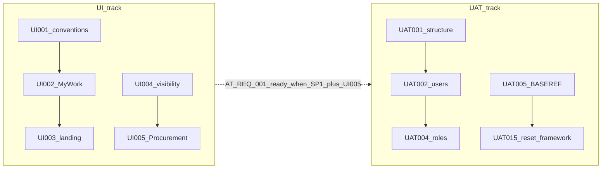

# KenTender UI / UAT implementation backlog (tracking)

**Purpose:** Sprint and PR tracking for **tester-facing workspaces**, **role/navigation scaffolding**, and **UAT seed/load/reset** work. Do **not** duplicate full objectives, Cursor prompts, or acceptance criteria here.

**Maintenance:** After each merged story (or agreed milestone), update the **Status** and **Notes** columns. Use `Done` only when that story’s criteria in the canonical pack are met.

**Status values:** `Not Started` | `In Progress` | `Blocked` | `Done`

**Canonical sources (read in this order; prompts stay in these files only):**

1. [KenTender UAT - Acceptance Testing Design Pack.md](KenTender%20UAT%20-%20Acceptance%20Testing%20Design%20Pack.md) — principles, workspace families, phased UI build, AT journey IDs.
2. [UI Acceptance Framework.md](UI%20Acceptance%20Framework.md) — unified navigation, persona-oriented UI.
3. [KenTender Workspace & UAT Matrix.md](KenTender%20Workspace%20%26%20UAT%20Matrix.md) — WS-001–011, R-001–R-022, shortcuts, recommended UI setup order (steps 1–4).
4. [KenTender Seed Data.md](KenTender%20Seed%20Data.md) — test users, SP1–SP7, BASE-* order, reset modes, full AT scripts.
5. [Workspace Implementation Backlog with Cursor.md](Workspace%20Implementation%20Backlog%20with%20Cursor.md) — **UI-STORY-001–015** definitions and prompts.
6. [KenTender UAT Seed Implementation Backlog with Cursor.md](KenTender%20UAT%20Seed%20Implementation%20Backlog%20with%20Cursor.md) — **UAT-STORY-001–020** definitions, loader order, prompts.

**Parallel engineering:** Backend/module waves (e.g. [Wave 2 backlog](../dev/WAVE%202%20BACKLOG.md)) can proceed in parallel; this backlog tracks **UI shell** and **UAT data engine** only.

---

## Prerequisites and assumptions

- **Workspace owner app:** Packs assume **`kentender_core`** owns global workspaces and landing/visibility rules. If that app does not exist yet, scaffold it or record an alternate owner in **Notes** on **UI-STORY-001**.
- **Frappe Role records:** Personas **R-001–R-022** need matching **Role** (and permission) definitions before **UAT-STORY-004** can complete. Create or extend roles as a prerequisite; track blockers in **Notes** on UAT-004 if roles lag.
- **Supplier experience:** Internal Desk workspaces must not replace the supplier portal; supplier flows stay separate per design pack.

---

## Cross-track execution narrative

Aligns with [KenTender Workspace & UAT Matrix.md](KenTender%20Workspace%20%26%20UAT%20Matrix.md) §10 and the seed backlog’s **recommended implementation order**.

- **Early UAT shell (UI):** UI-STORY-001 → 002 → 003 → 004, then **005–007** (My Work + Procurement + Evaluation + Contract — matrix Step 1).
- **Parallel seed engine (UAT):** UAT-STORY-001 → 002 → 003 → **004** (after roles exist) → 005 → 006 → 007, then **015–016** (reset framework + baseline resets) **before** SP1–SP7 loaders.
- **Expand navigation (UI):** UI-STORY-008–010 (matrix Step 2), then **011–013** (Step 3), **014**, **015** (queue/report naming polish).
- **Scenario packs (UAT):** UAT-STORY-008–014 (SP1→SP7), then **017–018**, **019–020**.

---

## Table A — Workspace / UI stories (UI-STORY-001–015)

Full definitions: [Workspace Implementation Backlog with Cursor.md](Workspace%20Implementation%20Backlog%20with%20Cursor.md).

| Story ID | Title (short) | Epic | Depends on (pack) | Step # | Status | Notes |
| --- | --- | --- | --- | --- | --- | --- |
| UI-STORY-001 | Shared workspace conventions and shell | EPIC-UI-001 | Wave 0 / platform foundation | 1 | Done | [`KenTender Workspace Conventions.md`](KenTender%20Workspace%20Conventions.md); workspaces live in **`kentender`** app (not `kentender_core` yet). |
| UI-STORY-002 | My Work workspace | EPIC-UI-001 | UI-STORY-001 | 2 | Done | **WS-001** — [`ken_tender_my_work.json`](../../kentender/kentender/kentender/workspace/ken_tender_my_work/ken_tender_my_work.json). |
| UI-STORY-003 | Default landing routing | EPIC-UI-001 | UI-STORY-002 | 3 | In Progress | Seeded users get **per-persona** `User.default_workspace` (Strategy / Budget / My Work / Procurement) via [`bootstrap.py`](../../kentender/kentender/uat/bootstrap.py); no global role→home hook yet. |
| UI-STORY-004 | Role-to-workspace visibility | EPIC-UI-003 | UI-STORY-001, UI-STORY-003 | 4 | In Progress | **KT UAT** roles (+ System Manager) on My Work, Procurement, Strategy, Budget; full R-001–R-022 map still pending. |
| UI-STORY-005 | Procurement Operations workspace | EPIC-UI-002 | UI-STORY-001, UI-STORY-004 | 5 | Done | **WS-004** — [`ken_tender_procurement.json`](../../kentender/kentender/kentender/workspace/ken_tender_procurement/ken_tender_procurement.json); wired to PR script reports + DocTypes. |
| UI-STORY-006 | Evaluation and Award workspace | EPIC-UI-002 | UI-STORY-004 | 6 | Not Started | **WS-005**. |
| UI-STORY-007 | Contract and Delivery workspace | EPIC-UI-002 | UI-STORY-004 | 7 | Not Started | **WS-006**. |
| UI-STORY-008 | Strategy and Planning workspace | EPIC-UI-002 | UI-STORY-004 | 8 | Done | **WS-002** — [`ken_tender_strategy.json`](../../kentender/kentender/kentender/workspace/ken_tender_strategy/ken_tender_strategy.json); Procurement Planner + read visibility for procurement/budget personas. |
| UI-STORY-009 | Budget Control workspace | EPIC-UI-002 | UI-STORY-004 | 9 | Done | **WS-003** — [`ken_tender_budget.json`](../../kentender/kentender/kentender/workspace/ken_tender_budget/ken_tender_budget.json); Budget Controller + finance/read chain. |
| UI-STORY-010 | Governance and Complaints workspace | EPIC-UI-002 | UI-STORY-004 | 10 | Not Started | **WS-007**. |
| UI-STORY-011 | Stores workspace | EPIC-UI-002 | UI-STORY-004 | 11 | Not Started | **WS-008**. |
| UI-STORY-012 | Assets workspace | EPIC-UI-002 | UI-STORY-004 | 12 | Not Started | **WS-009**. |
| UI-STORY-013 | Audit and Oversight workspace | EPIC-UI-002 | UI-STORY-004 | 13 | Not Started | **WS-010**. |
| UI-STORY-014 | Administration workspace | EPIC-UI-002 | UI-STORY-004 | 14 | Not Started | **WS-011**; admin-only. |
| UI-STORY-015 | Queue and report shortcut standardization | EPIC-UI-004 | UI-STORY-002 … UI-STORY-014 | 15 | Not Started | Naming alignment across workspaces; task-first labels. |

---

## Table B — UAT seed stories (UAT-STORY-001–020)

**Step #** = recommended run order from [KenTender UAT Seed Implementation Backlog with Cursor.md](KenTender%20UAT%20Seed%20Implementation%20Backlog%20with%20Cursor.md) §“Recommended implementation order” (not raw story ID order).

Full definitions: same file.

| Story ID | Title (short) | Epic | Depends on (pack) | Step # | Status | Notes |
| --- | --- | --- | --- | --- | --- | --- |
| UAT-STORY-001 | UAT fixture folder structure and conventions | EPIC-UAT-001 | Workspace foundation only | 1 | Done | Repo [`uat/`](../../uat/) + [`README`](../../uat/README.md). |
| UAT-STORY-002 | Seeded internal test users | EPIC-UAT-001 | UAT-STORY-001 | 2 | In Progress | **Minimal golden** desk users only (`minimal_golden_canonical.json`). **MVP:** same emails via [`kentender.uat.mvp.commands.seed_uat_mvp`](../../kentender/kentender/uat/mvp/commands.py) for `UAT-MVP*` data. |
| UAT-STORY-003 | Seeded supplier test users | EPIC-UAT-001 | UAT-STORY-001 | 3 | In Progress | **Minimal golden** Website Users (`supplier1/2.test@ken-tender.test`). MVP seed reuses them. Legacy supplieradmin/supplieruser IDs still future. |
| UAT-STORY-004 | Role and persona assignment loader | EPIC-UAT-001 | UAT-002, UAT-003; Frappe Roles for personas | 4 | In Progress | **KT UAT** roles + MVP extras (`Evaluator`, `Accounting Officer`, `Supplier`); valid user↔role in MVP/bootstrap commands. |
| UAT-STORY-005 | BASE-REF loader | EPIC-UAT-002 | Core master data where applicable | 5 | Done | MVP: [`kentender.uat.mvp.base_ref`](../../kentender/kentender/uat/mvp/base_ref.py) + [`mvp_canonical.json`](../../uat/seed_packs/mvp_canonical.json). |
| UAT-STORY-006 | BASE-STRAT loader | EPIC-UAT-002 | UAT-005; strategy module | 6 | Done | MVP: [`kentender.uat.mvp.base_strat`](../../kentender/kentender/uat/mvp/base_strat.py). |
| UAT-STORY-007 | BASE-BUD loader | EPIC-UAT-002 | UAT-005, UAT-006; budget module | 7 | Done | MVP: [`kentender.uat.mvp.base_bud`](../../kentender/kentender/uat/mvp/base_bud.py); healthy + constrained lines. |
| UAT-STORY-015 | Reset command framework | EPIC-UAT-004 | Loader structure from 001–014 | 8 | In Progress | MVP: [`reset_mvp_seed_data`](../../kentender/kentender/uat/mvp/reset.py); scoped to `UAT-MVP*` keys / `UAT-MVP-PR-%`. |
| UAT-STORY-016 | Baseline reset commands | EPIC-UAT-004 | UAT-015; UAT-005–007 | 9 | In Progress | `reset_uat_mvp_console` = delete MVP slice + `seed_uat_mvp`. |
| UAT-STORY-008 | SP1 loader (Requisition flow) | EPIC-UAT-003 | Baseline packs | 10 | Done | MVP: [`kentender.uat.mvp.sp1`](../../kentender/kentender/uat/mvp/sp1.py) (draft / returned / approved + reservation). |
| UAT-STORY-009 | SP2 loader (Planning / tender prep) | EPIC-UAT-003 | SP1 / baseline as needed | 11 | Not Started | AT-PLAN-001, AT-TDR-001 setup. |
| UAT-STORY-010 | SP3 loader (Published tender / bids) | EPIC-UAT-003 | SP2 or equivalent | 12 | Not Started | AT-BID-001, AT-OPEN-001. |
| UAT-STORY-011 | SP4 loader (Evaluation / award) | EPIC-UAT-003 | SP3 or equivalent | 13 | Not Started | AT-EVAL-001, AT-AWD-001. |
| UAT-STORY-012 | SP5 loader (Contract / inspection) | EPIC-UAT-003 | SP4 or equivalent | 14 | Not Started | AT-CON-001, AT-INSP-001. |
| UAT-STORY-013 | SP6 loader (Complaint / hold) | EPIC-UAT-003 | SP5 or equivalent | 15 | Not Started | AT-CMP-001. |
| UAT-STORY-014 | SP7 loader (Stores / assets) | EPIC-UAT-003 | SP5/6 as needed | 16 | Not Started | AT-STORES-001, AT-ASSET-001. |
| UAT-STORY-017 | Scenario reset commands | EPIC-UAT-004 | UAT-016; SP loaders | 17 | Not Started | e.g. reset to SP1, SP3, SP5, SP6. |
| UAT-STORY-018 | Full E2E reset command | EPIC-UAT-004 | UAT-017 | 18 | Not Started | BASE + SP1–SP7 in order. |
| UAT-STORY-019 | UAT metadata helpers | EPIC-UAT-005 | Seeded scenarios | 19 | Not Started | Prefixes, tags, list visibility. |
| UAT-STORY-020 | Seed verification report command | EPIC-UAT-005 | Major loaders | 20 | In Progress | MVP: `verify_uat_mvp_console` (PR scope); SP2+ IDs reported as n/a until loaders exist. |

---

## Table C — Acceptance journeys (execution / script readiness)

**Purpose:** Track **UAT execution** or **script readiness** separately from dev story **Done** in Tables A–B. Full steps: [KenTender Seed Data.md](KenTender%20Seed%20Data.md) §7.

| Journey ID | Title (short) | Primary seed pack | Status | Notes |
| --- | --- | --- | --- | --- |
| AT-REQ-001 | Submit and approve requisition | SP1 | Script ready | `seed_uat_mvp_console` + `verify_uat_mvp_console`; approved PR `UAT-MVP-PR-APPROVED` with budget reservation. |
| AT-REQ-002 | Returned requisition flow | SP1 | Script ready | MVP seed includes `UAT-MVP-PR-RETURNED` (submit → HOD return). |
| AT-PLAN-001 | Create procurement plan from approved demand | SP2 | Not Started | |
| AT-TDR-001 | Create and publish tender | SP2 / SP3 | Not Started | |
| AT-BID-001 | Supplier bid submission | SP3 | Not Started | Supplier portal. |
| AT-OPEN-001 | Execute bid opening | SP3 | Not Started | |
| AT-EVAL-001 | Evaluate and submit report | SP4 | Not Started | |
| AT-AWD-001 | Award approval and standstill | SP4 | Not Started | |
| AT-CON-001 | Contract creation, signing, activation | SP5 | Not Started | |
| AT-INSP-001 | Parameter-based inspection and acceptance | SP5 | Not Started | |
| AT-CMP-001 | Complaint submission and award hold | SP6 | Not Started | |
| AT-STORES-001 | Receive accepted goods into stores | SP7 | Not Started | |
| AT-ASSET-001 | Register procured asset and assign custody | SP7 | Not Started | |

**Status (Table C) suggestions:** `Not Started` | `Script ready` | `In progress` | `Passed` | `Failed` | `Blocked`

---

## Review checklist (after each story)

- Deterministic, idempotent loaders where promised.
- No unrelated scenario mixing.
- Verification output / summary where required.
- Testers can find **My Work** / role landing and key shortcuts without raw DocType search (UI stories).
